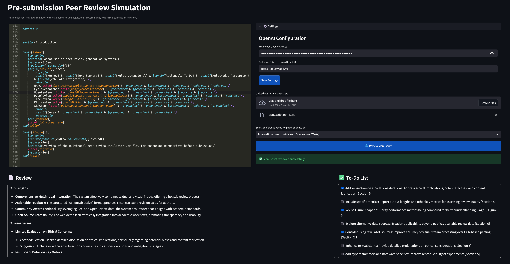

## Multimodal Peer Review Simulation with Actionable To-Do Suggestions for Community-Aware Pre-Submission Revisions


<a href="https://www.python.org/">

</a>
<a href="https://opensource.org/licenses/MIT">

</a>


---

### Quick Start: Run the Demo System

Follow these simple steps to launch the web-based demo system:

1. **Clone the repository**:
   ```bash
   git clone https://github.com/multimoda-peer-review-simulation.git
   cd multimoda-peer-review-simulation

   python -m venv venv
   source venv/bin/activate
   ```

2. **Install dependencies**:
   ```bash
   sudo apt-get update
   sudo apt-get install poppler-utils

   pip install -r requirements.txt
   ```

3. **Launch the web-based demo**:
   ```bash
   streamlit run app.py --server.address 0.0.0.0 --server.port=8080
   ```

This will launch a local web server. To generate a review for your paper, enter your OpenAI API key and upload the manuscript PDF. The review process usually takes between one and three minutes, depending on the length of your paper.

